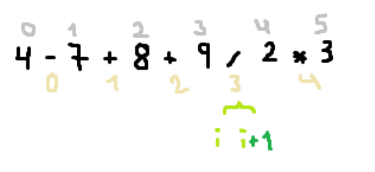
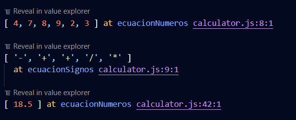
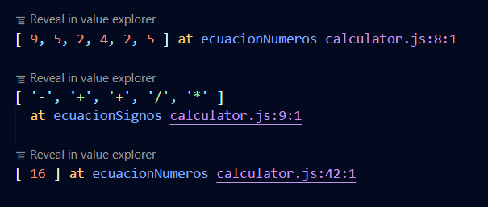

# Lógica y uso de lenguaje JavaScript ES6+

_Una calculadora de operaciones básicas que resuelve las operaciones dada una cadena._
_Por ejemplo: Si el usuario introduce 4-7+8+9/2*3 el programa deberá mostrar como resultado 18.5_

## > Descripción

- Como primer paso almacené el string con la operación en una variable **let**.
- Cree dos variables con expreciones regulares, una contiene los signos y la otra los números.
- Mi algoritmo comienza con separar los números con los signos. 
    - Con **.split()** y las expresiones regulares antes declaradas obtuve dos arrays.
    - Con **.map()** convertí mi array de string a números.
    - Con **.slice()** solucioné un bug de espacios en los signos.

## > Algoritmo

- Con un ciclo **For** recorro mi array de signos.
- Si el signo actual es **== signoBuscado**
    - Tomo la posición del array del signo y mando a llamar esa misma posición del array de los números.
    - Opero la posición actual del array de los números con la posición actual + 1.
    - Con **.splice()** sustituyo el valor actual por el resultado y elimino los datos anteriores.
    - Con **.splice()** También elimino el signo ya operado.
- Tenía un bug que me dejaba dos operaciones si realizar.
    - Para solucionarlo utilicé un ciclo **While** y coloqué mi ciclo **for** dentro de el.

## > Testing

